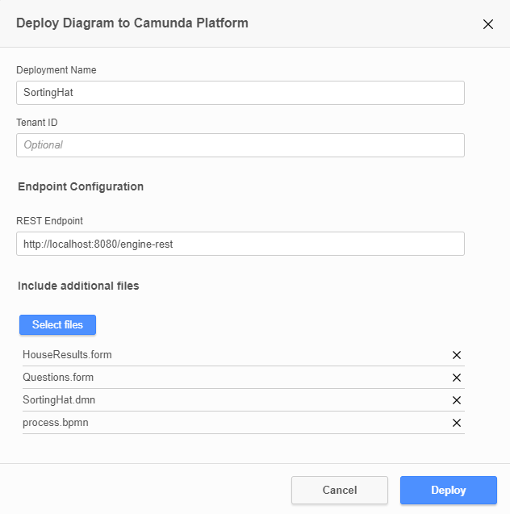
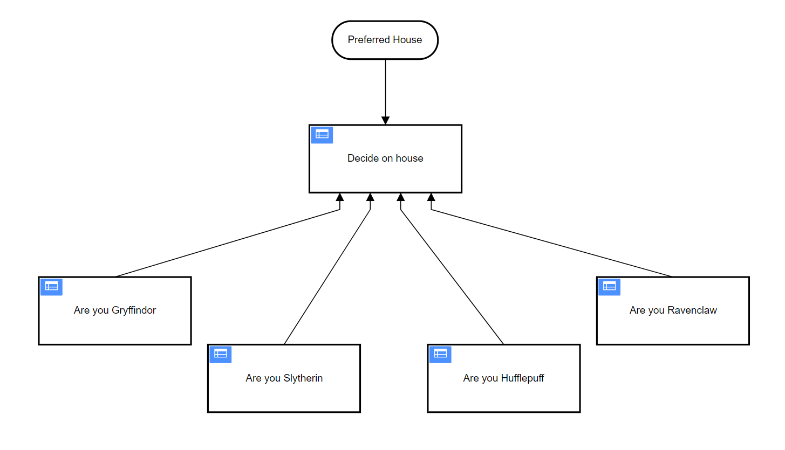
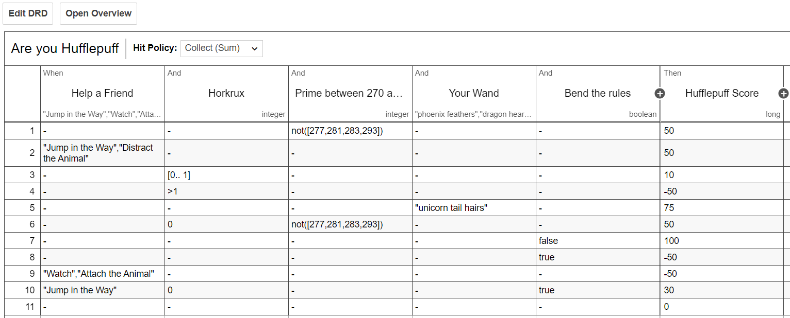
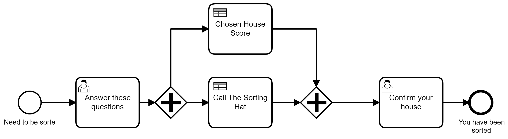

# DMN Sorting Hat
This is an example of how DMN could have been used in the harry Potter universe to replace the sorting hat

## What You will Need
* [Java JDK 11](https://www.oracle.com/java/technologies/javase-jdk11-downloads.html) so that you can run Camunda Platform Run
* [Camunda Platform Run](https://camunda.com/download/) for running BPMN and DMN models
* [Camunda Modeler](https://camunda.com/download/modeler/) for deploying the DMN and BPMN Models

## Running the Project

Startup the Camunda platform.
Open the files in the ``/DMN-BPMN-Models`` and ``/Forms`` folder in the Camunda modeler. From there you can also deploy them by clicking on the deploy button:

 

then adding all of the files to as part of the deployment.



Once the deployment is successful you can go to `` http://localhost:8080/camunda/app/tasklist/`` login with ``demo/demo`` and start the process!

## The DRD
The highest level you can view the decision is by looking at the Decision requirements diagram.


## The DMN Tables
There are 5 DMN tables in this project. Four of them relate to a House in Harry Potter and return a number. The number that each table returns refers to the affinity a user has with that house. The higher the number, the more affinity to a given house a user.



The hit policy of each table is set to `Collect (Sum)` meaning that multiple rules on this table can match a set of input values. A value called `Score` exists for each rule. All rules that match would have their `Score` added together to give you a single result. This result is the affinity you have for the given house


## The BPMN Model

The BPMN model lets a user enter some data through a UI and then passes that data to the DMN model. It then can take the result and show it to the user in a new user task.




## Evaluating the DMN tables with SwaggerUI
You can evaluate the DMN tables from the Camunda Platform's inbuilt SwaggerUI by going to `http://localhost:8080/swaggerui/#/`
Finding `Decision Definition` in the list and clicking on the `POST /decision-definition/key/{key}/evaluate` call. 

Enter the key as `DecideOnHouse` and you can use the below example as the call body

```Json
{
    "variables": {
      "friend": {
        "value": "Jump in the Way",
        "type": "String"
      },
      "houseChoice": {
        "value": "Slytherin",
        "type": "String"
      },
      "wand": {
        "value": "phoenix feathers",
        "type": "String"
      },
      "quidditch": {
        "value": true,
        "type": "Boolean"
      },
      "horkrux": {
        "value": 11,
        "type": "Long"
      },
      "potion": {
        "value": "Beautification Potion",
        "type": "String"
      },
      "rules": {
        "value": true,
        "type": "Boolean"
      },
      "robes": {
        "value": true,
        "type": "Boolean"
      },
      "prime": {
        "value": 280,
        "type": "Long"
      },
      "milk": {
        "value": 0.75,
        "type": "Double"
      }
    }
  
  }
```
